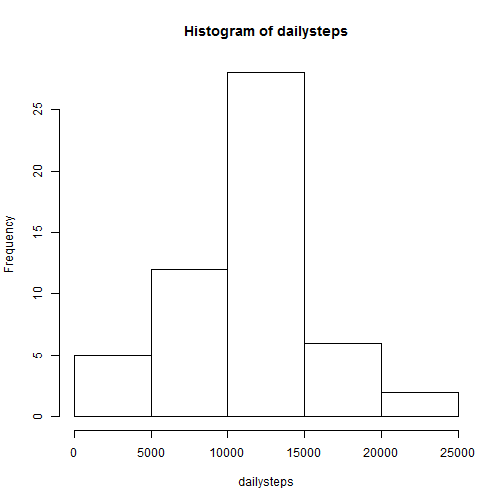
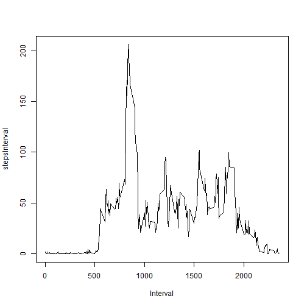
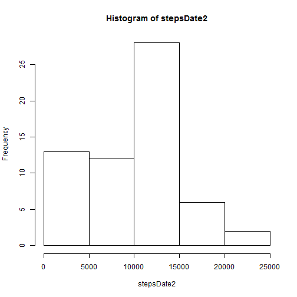
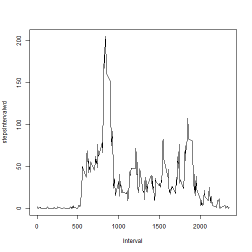
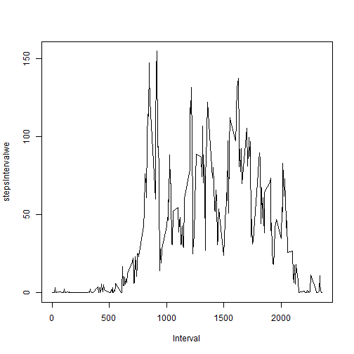

Reproducible Research Assignment #1
====================================

Load the Data into a data frame called "data".


```r
data <- read.csv("activity.csv")
```


## What is mean total number of steps taken per day?

### 1. Make a histogram of the total number of steps taken each day.

First, sum steps by date and store value in a new object called "stepsDate":


```r
stepsDate <- tapply(data$steps, data$date, sum)
```


Next, remove NA values and store remaining values in an object called "dailysteps":


```r
dailysteps <- stepsDate[!is.na(stepsDate)]
```


Finally, plot histogram of total steps per day:


```r
hist(dailysteps)
```

 


### 2. Calculate and report the **mean** and **median** total number of steps taken per day.


```r
mean(dailysteps)
```

```
## [1] 10766
```

```r
median(dailysteps)
```

```
## [1] 10765
```


## What is the average daily activity pattern?

### 1. Make a time series plot (ie. type = "l") of the 5-minute interval(x-axis) and the average number of steps taken, averaged across all days(y-axis).

First, remove all NA values from Steps column:

```r
badrows <- is.na(data$steps)
good.data <- data[!badrows, ]
```


Then, average steps by interval (across all days) and store in an object called stepsInterval:

```r
stepsInterval <- tapply(good.data$steps, good.data$interval, mean)
```


Next, create an object that contains all of the unique Interval values:


```r
Interval <- unique(data$interval)
```


Finally, plot Interval against stepsInterval:


```r
plot(Interval, stepsInterval, type = "l")
```

 


### 2. Which 5-minute interval, on average across all the days in the dataset, contains the maximum number of steps?

First, combine the stepsInterval and Interval objects into a single dataframe:


```r
df <- data.frame(stepsInterval, Interval)
```


Next, find the Interval value that corresponds to the max stepsInterval value:


```r
maxSteps <- df[stepsInterval == max(stepsInterval), ]
maxSteps$Interval
```

```
## [1] 835
```


## Imputing missing values
### 1. Calculate and report the total number of missing values in the dataset.

First, get an understanding of where the NA values are:


```r
datebad <- is.na(data$date)
sum(datebad)
```

```
## [1] 0
```

```r

intervalbad <- is.na(data$interval)
sum(intervalbad)
```

```
## [1] 0
```

```r

stepsbad <- is.na(data$steps)
sum(stepsbad)
```

```
## [1] 2304
```


Only the steps column contains NA values (this check was for my own peace of mind to make sure that if i did a sum of NA values in the data set I wouldn't double count rows that had multiple NA values).

Now, count them:

```r
sum(is.na(data))
```

```
## [1] 2304
```


### 2. Devise a strategy for filling in all of the missing values in the dataset. The strategy does not need to be sophisticated. For example, you could use the mean/median for that day, or the mean for that 5-minute interval, etc.

My strategy for filling in missing values will be to use the median value for the corresponding interval, across all days. 

So first, create an array that contains all the median step values across all days for each interval. The median values for each interval need to be repeated for each date so that the length of the new data frame is the same length as the original data set:


```r
Steps <- tapply(good.data$steps, good.data$interval, median)

days <- unique(data$date)
medianSteps <- rep(Steps, times = length(days))
dfSteps <- data.frame(medianSteps)
```


Next, create an integer vector that contains a list of all the rows in data$steps that need replacement values:

```r
replacementRows <- which(is.na(data$steps))
```


And use that vector to isolate the values in dfSteps that will be replacing NA values:

```r
replacementSteps <- dfSteps[replacementRows, ]
length(replacementSteps)
```

```
## [1] 2304
```

```r
sum(is.na(data))
```

```
## [1] 2304
```


### 3. Create a new dataset that is equal to the original dataset but with the missing data filled in.

Replace all NA values in the original data set with the median value of steps for the corresponding interval and store new data set as data1:


```r
data1 <- data
data1$steps[is.na(data1$steps)] <- replacementSteps
```


Check to make sure there aren't any more NA values:


```r
sum(is.na(data1))
```

```
## [1] 0
```


### 4.Make a histogram of the total number of steps taken each day...

First, sum steps by date and store value in a new object called "stepsDate2":


```r
stepsDate2 <- tapply(data1$steps, data1$date, sum)
```


Plot histogram of total steps per day:


```r
hist(stepsDate2)
```

 


### ...and Calculate and report the mean and median total number of steps taken per day.


```r
mean(stepsDate2)
```

```
## [1] 9504
```

```r
median(stepsDate2)
```

```
## [1] 10395
```


### Do these values differ from the estimates from the first part of the assignment? What is the impact of imputing missing data on the estimates of the total daily number of steps?

The impact of imputing the missing data has been to skew the data to the left - the average number of steps per day is now much lower.

## Are there differences in activity patterns between weekdays and weekends?

### 1. Create a new factor variable in the dataset with two levels - "weekday" and "weekend" indicating whether a given date is a weekday or weekend day.

First, install the chron package:


```r
library(chron)
```


Then, create a vector of all the dates in data and use the weekdays command to convert the values to the weekday:


```r
dates <- as.Date(data1$date)
weekdays <- weekdays(dates)
```


Next, convert the values in the weekdays vector to either "weekday" or "weekend":


```r
for (i in 1:length(weekdays)) {
    if (weekdays[i] == "Monday") {
        weekdays[i] <- "weekday"
    } else if (weekdays[i] == "Tuesday") {
        weekdays[i] <- "weekday"
    } else if (weekdays[i] == "Wednesday") {
        weekdays[i] <- "weekday"
    } else if (weekdays[i] == "Thursday") {
        weekdays[i] <- "weekday"
    } else if (weekdays[i] == "Friday") {
        weekdays[i] <- "weekday"
    } else if (weekdays[i] == "Saturday") {
        weekdays[i] <- "weekend"
    } else if (weekdays[i] == "Sunday") {
        weekdays[i] <- "weekend"
    }
}
```


Finally, add the weekdays vector to the data1 frame as a new factor variable. 


```r
data1$weekday <- weekdays
```


### 2. Make a panel plot containing a time series plot (i.e. type = "l") of the 5-minute interval (x-axis) and the average number of steps taken, averaged across all weekday days or weekend days (y-axis). 

First, separate the data by weekday variable:


```r
weekday <- data1[data1[, "weekday"] == "weekday", ]
weekend <- data1[data1[, "weekday"] == "weekend", ]
```


Next, average the steps by interval across all days:


```r
stepsIntervalwd <- tapply(weekday$steps, weekday$interval, mean)
stepsIntervalwe <- tapply(weekend$steps, weekend$interval, mean)
```


Finally, plot Interval against stepsIntervalwd and stepsIntervalwe:


```r
plot(Interval, stepsIntervalwd, type = "l")
```

 

```r
plot(Interval, stepsIntervalwe, type = "l")
```

 

